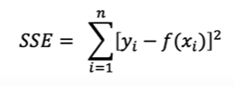
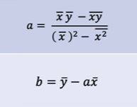
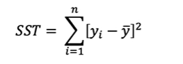
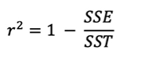

## Linear Regression
* identify a linear relationship from scattered data
* model a dependent variable from on eof more indepndent variable
* bivariate data: one dependent, one independent variable
* key assumption
  * one variable is a function of another variable

* reason for use
  * cause and effect relationships (hookes law)
  * changes over time (material cooling down)
  * making predictions
  * correlations

### Least squares regression
* method to determine best fit line fx = ax + b that minimizes the sum of errors between model and data

that is the SSE formula
* measures how well a model matches actual data
* we should find the values of a and b so that the error is minimized
* the error term of the i'th data point, e(i) is the distance in the y direction between each data point's y value and the model line
  * we want to reduce this
* why squares? 
  * we dont want negative errors. All errors must be squared to avoid negative errors cancelling
* represents variance in data not explained by model

### Errors
* errors are distance from data values from our model line
* not about accuracy or precision of our data
* when the parabola of the vertex

* these are the equations for a and y
* the line above the variables means average

### Applying linear regression
* limitation on use
  * there might be only a certain interval on which linear regression works
  * extrapolation beyond limits is not good
  * if you extrapolate, you need to justify it

### verifying model of best fit
#### SST
* one way to say if we need the line of best fit is to compare all values y to the average value of y for the dataset
* sum of squares total

* measures variability in data.
* if variablity is low, this indicates that there is minimal relationship between x and y
* if the value is large, there is large deviation from the mean. 
* SST alone is not enough to verify a relationship
* sum of squares total
* sum of squares of deviation

#### Coefficient of determination, r^2

* proportion of the variance in the dependent variable that is predictable from independent variable
* calculate fraction of variants the model explains
* use relationship of sse and sst to determine how well the mdoel fits

* since SSE / SST is the fraction of variants the model doesnt explain, we subtract it from 1 to find what percent is explained

##### interpretation of r^2
* measures the extent a model explains variance
* varies between 0 and 1, closer to 1, better the firt
* r^2 small does NOT indicate small error
* r^2 can only measure fit of model to its data, doesnt indicate anything about measurement
* r^2 of 0.75 means 75% of the values are explained by the model
* correlation: much of the variation is y is explained by the variation in x

### Correlation coefficient
* what is r without the square?
* correlation coefficient, measurement of strength and direction of correlation between independent and dependent variables
* r is square root of r^2
* r varies fro -1 to 1. R value close to 0 means very little correlation
* r is positive with direct relationships, positive slope. Negative with indirect relationships, negative slope